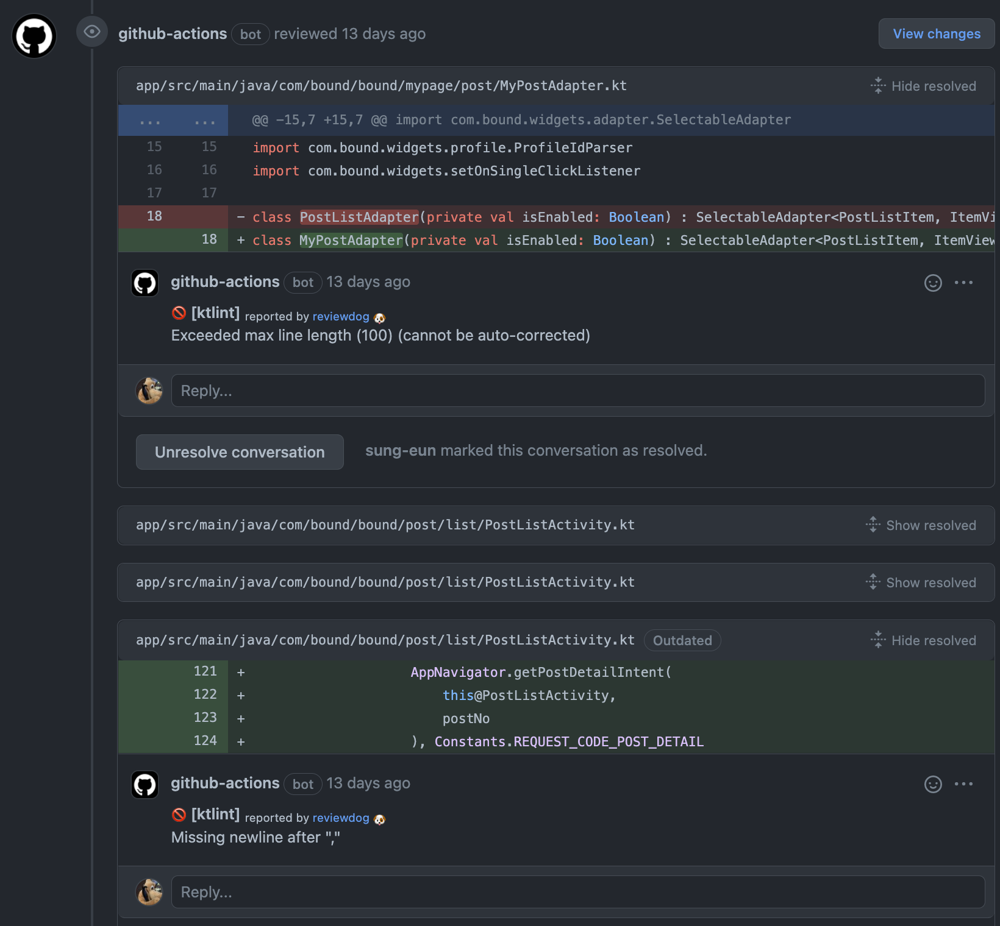
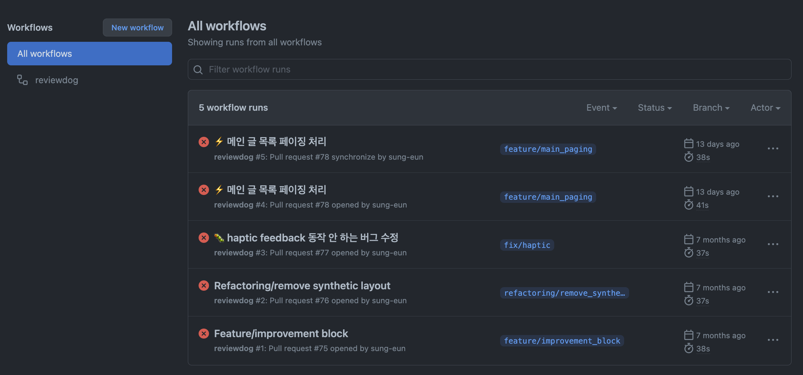

Github Action과 ReviewDog을 이용하여 간편하게 PR 리뷰를 자동화할 수 있다.<br>
SonarLint 연동은 서버 환경도 필요해 보였는데, Github Action을 이용하면 자동화하기가 더 편리했다.<br>

ReviewDog을 이용하여 Ktlint 체크를 지원하는 [ScaCap/action-ktlint](https://github.com/ScaCap/action-ktlint)를 사용하였다.

### .github/workflow에 .yml 파일 정의

```yaml
name: reviewdog
on: [pull_request]

jobs:
  ktlint:
    name: Check Code Quality
    runs-on: ubuntu-latest

    steps:
      - name: Clone repo
        uses: actions/checkout@main
        with:
          fetch-depth: 1

      - name: ktlint
        uses: ScaCap/action-ktlint@master
        with:
          github_token: ${{ secrets.github_token }}
          reporter: github-pr-review
          android: true
          fail_on_error: true
          level: warning
```

또는 직접 yml 파일을 작성하지 않고, [GitHub Marketplace](https://github.com/marketplace?type=actions&query=ktlint+)에서 검색하여, 원하는 Action을 선택하여 추가할 수도 있다.

### ktlint Action options

 `ktlint` 하위 `with`에 있는 여러 옵션을 다르게 주어 원하는 방식으로 사용할 수 있다.

> [옵션에 대한 가이드 >](https://github.com/ScaCap/action-ktlint#inputs)  

예시 코드에 적은 몇 가지만 설명하자면,<br>

* reporter
	* `github-pr-review`: 댓글로 리뷰 추가
	* `github-pr-check`: Annotation으로 추가
* android: [Android Kotlin Code Style](https://android.github.io/kotlin-guides/style.html)도 함께 체크할 것인지
* fail_on_error: 오류가 발견되면 실패로 처리할 것인지
* level: Lint 레벨

### 사용 예시
PR을 생성하면, 아래와 같이 문제가 있는 라인마다 봇이 댓글을 달아준다.



해당 PR의 수정사항이 추가되면 다시 Action이 실행되어 Lint 체크도 다시 수행된다.<br>

Action 탭에 가면 그 동안 실행했던 Action들의 결과도 볼 수 있다.



ktlint 설정 시 fail_on_error 옵션을 true로 했기 때문에, Lint 이슈가 있는 PR들은 실패로 표시된 것을 확인할 수 있다.

****

혼자서 개발하면서 Lint 체크를 자동화할 수 있어서 좋았지만, `Exceeded max line length (100)` 처럼 개발환경에서 세팅한 값과 다르게 체크되는 부분은 조금 번거롭게 느껴졌다.<br>
원하는 Lint 규칙을 제외하거나 추가할 수 있는 방법을 찾아보고 적용해봐야겠다.
