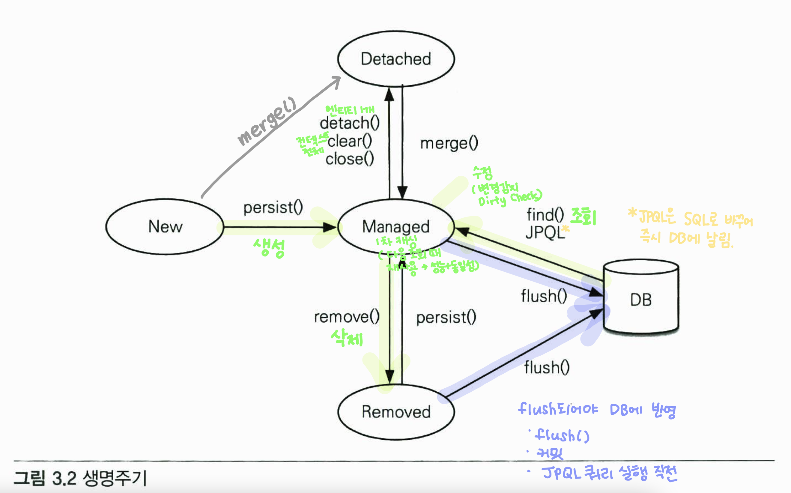

### 1장. JPA 소개

* 애플리케이션에서 SQL을 직접 다루면, 테이블 설계 변경 시 수정해야할 코드의 양이 많고, 유지보수 시에 SQL을 꼭 확인해야 하는 일이 생긴다. 
* 객체지향의 패러다임과 RDB의 패러다임은 맞지않아서 객체지향의 상속, 연관관계, 그래프탐색, 동등성 비교 등을 표현하는 데는 한계가 있다. 
* JPA는 JAVA 진영의 ORM으로, JPA를 사용하면 엔티티의 변경을 감지하여 SQL을 직접 짜주어 개발자가 신경쓸 일이 줄어든다. 또한 객체 중심적으로 개발할 수 있게 해준다. 

### 2장. JPA 시작

* H2 DB를 로컬PC에 설치하여 실행하고 서버모드로 접속하였다.
* JAVA 애플리케이션의 `persistence.xml`에 JDBC 접속정보와 JDBC 관련 로그 설정하였다. 
* JAVA 애플리케이션에 JPA 설정을 추가하였다. 
* JAVA 애플리케이션을 실행하여 JPA가 동작하는 것을 확인하였다.

### 3장. 영속성 관리

* JPA는 영속성 매니저를 통해 영속성 컨텍스트를 관리한다.
* 영속상태의 엔티티는 1차 캐시, 동일성보장, 트랜잭션 시까지 쓰기지연, 변경 감지, 지연 로딩을 지원한다. 
* 영속상태가 되려면, 엔티티 생성해 `persist()`하거나, 엔티티를 DB에서 조회하면 된다. 
* 비영속상태가 되려면, 엔티티를 삭제하거나, `detach()`, 엔티티컨텍스트를 `clear()`, `close()`하면 된다. 
* 플러시는 영속 엔티티를 DB와 동기화하는 것으로 `flush()`, 트랜잭션 커밋 시, JPQL 실행 직전에 호출된다. 

**참고. 엔티티의 생명주기**

## 출처

* 김영한.  『JAVA ORM 표준 JPA 프로그래밍』. 서울: 에이콘 출판, 2015
